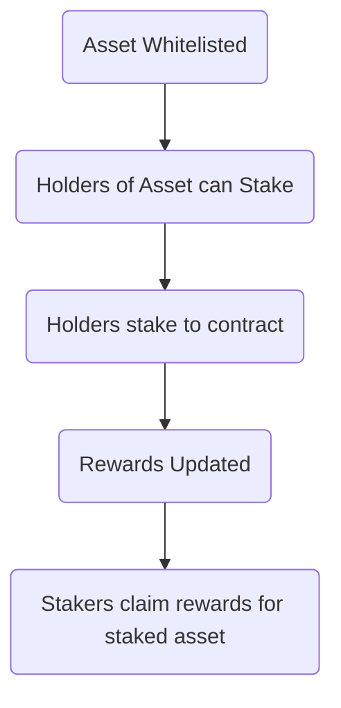
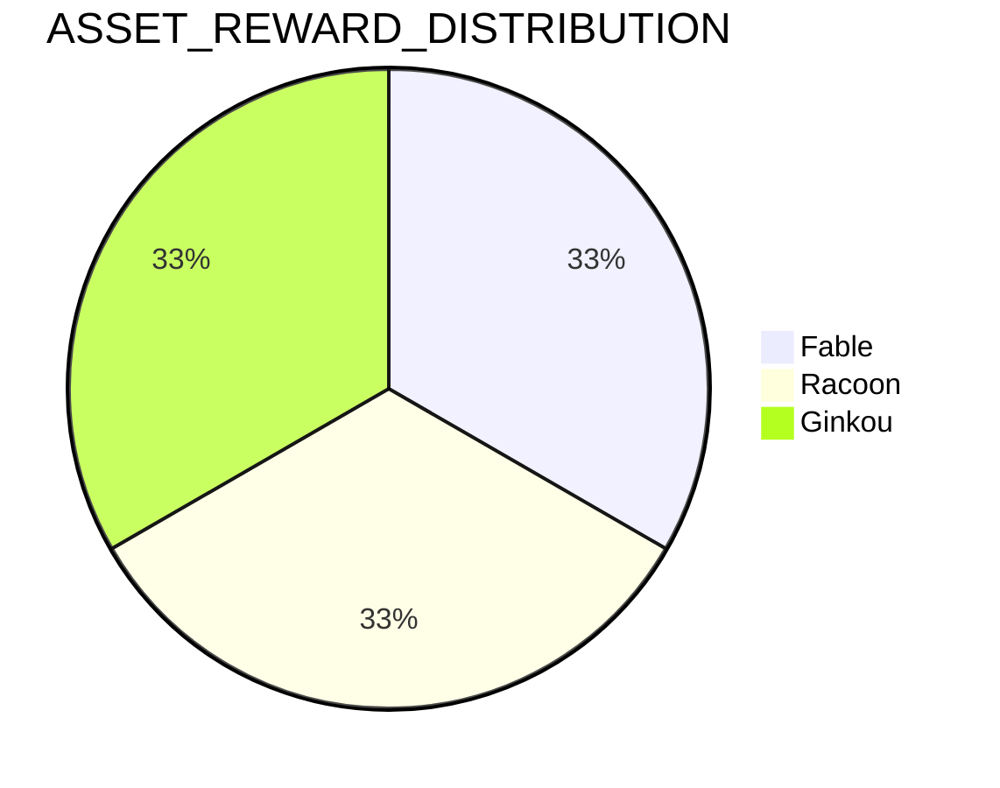
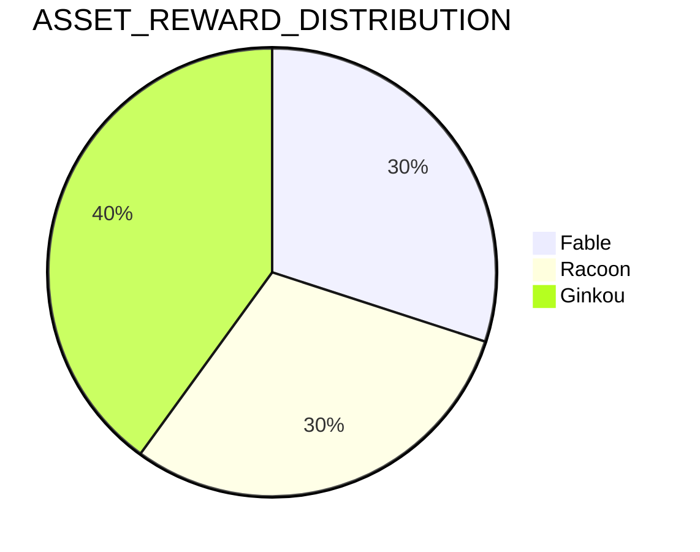
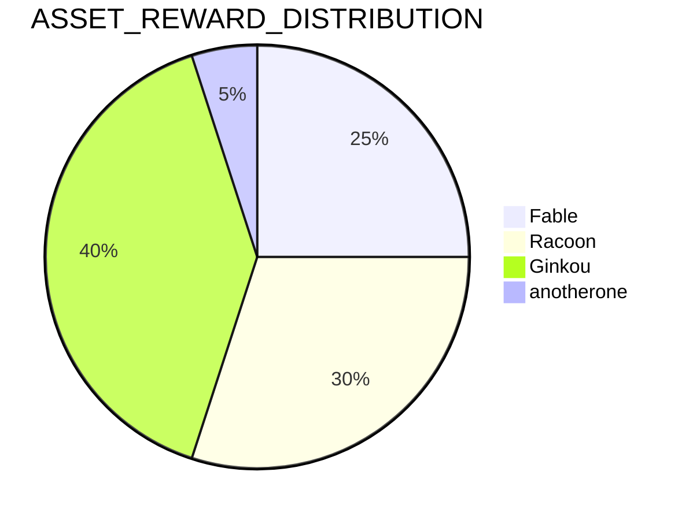

# CW Alliance Hub Furya
# Alliance Hub Furya

- [CW Alliance Hub Furya](#cw-alliance-hub-furya)
- [Alliance Hub Furya](#alliance-hub-furya)
	- [Overview](#overview)
	- [Deployments and associated information](#deployments-and-associated-information)
	- [Usage](#usage)
		- [Intent](#intent)
			- [For Holders](#for-holders)
			- [For Chain](#for-chain)
			- [Contract methods](#contract-methods)
				- [Instantiate](#instantiate)
				- [Whitelisting Assets](#whitelisting-assets)
				- [Reward Distribution](#reward-distribution)
				- [Updating rewards](#updating-rewards)
			- [User facing methods](#user-facing-methods)
				- [Claiming rewards](#claiming-rewards)
- [Development](#development)
- [Deployment](#deployment)


## Overview

Alliance is an open-source Cosmos SDK module that leverages interchain staking to form economic alliances among blockchains.

🛠 How Alliance works
Alliance is an [open-source Cosmos SDK module](https://github.com/terra-money/alliance) that leverages interchain staking to form economic alliances among blockchains. The following section is a general outline of the Alliance module. For a detailed overview of how Alliance staking works, visit the [in-depth concepts section](https://docs.alliance.money/concepts/staking).

For the most up-to-date references to Alliance head to Terra's [Alliance Documentation](https://docs.alliance.money/)

This doc will be focused on the Furya-based fork which adds support for CW20s and other customizations as well as removing the Oracle based system and replacing it with a more simple Gauge of distribution percentages. This design may be improved at a later point to use Gauges for the reallocation of distributions based on some criteria. For example we could have a number of LP tokens which over time have their weights adjusted either by governance votes or by some other mechanism for example the amount of volume they are providing to the network or the fees. The first system mentioned which includes a Gauge is closely modelled after Curves Gauges system and the second could more akin to Terra's implementation of Alliance with the Oracle system. 

Where to use this contract: [Furya Zone](https://app.furya.zone/)

## Deployments and associated information

| Label                            | Code ID | Admin                                          | Deployment                                                                                  |
| -------------------------------- | ------- | ---------------------------------------------- | ------------------------------------------------------------------------------------------- |
| FuryaAllianceEcosystemAccelerator | 145      | furya1hhcd5n88609uyuscxt6l4tqm88lv6963mrqmxmeuq50rcr3l5pqsj3rslm | furyad tx wasm execute furya1hhcd5n88609uyuscxt6l4tqm88lv6963mrqmxmeuq50rcr3l5pqsj3rslm |

## Usage 

### Intent

The Furya Alliance module is intended to be used to stimulate the economies of projects by redirecting some inflation to holders who stake their token based on configurable weighting.

#### For Holders
Stake idle CW20s for redirected inflation through Alliance
Stake unbonded LP tokens for redirected inflation through Alliance

#### For Chain
Stimulate the economies of projects by redirecting some inflation to holders who stake their token based on configurable weighting.

#### Contract methods 

##### Instantiate 
When instantiating a number of actor addrs must be provided for the governance, the controller and the oracle. These can all be set to the same address if desired but its split to allow better role based access




##### Whitelisting Assets 

Assets are whitelisted before users can stake and unstake. 
Additionally the reward distribution must be set for any whitelisted asset to receive some redirected inflation assets. 

Whitelisting an asset is done by an admin/governance role and can be done like so: 

```bash
./furyad tx wasm execute furya14hj2tavq8fpesdwxxcu44rty3hh90vhujrvcmstl4zr3txmfvw9s58v48z '{ "whitelist_assets": {"test-chain-GKFJpU": [{"cw20": "furya1xr3rq8yvd7qplsw5yx90ftsr2zdhg4e9z60h5duusgxpv72hud3s54xttx"}]}' --from new_deploy_wallet --gas auto --gas-adjustment 1.4
```
After which any holders of that asset can now stake and unstake. Rewards will only be accumulated if the asset is also included in the reward_distribution.

##### Reward Distribution 
The Reward Distribution represents a vector of assets and their respective weights for the sharing of the redirected inflation 
The weights must add to 100% when being set. 

Important to note reward distribution is separate from whitelisting for a reason. This enables assets to be whitelisted before any rewards are shared and additionally ensures rewards are independent of the whitelist.

Also important to note setting new reward distributions is a one-hot operation that needs to be done with the entire list of distribution. 
This removes any recalculation logic from the contract and enforces that the governance/admin actor must provide any updated rates and that despite updates they all add to 100%. 

Example: 
3 assets are whitelisted and a reward distribution is set at 33% for each. 



At some point in the future this reward distribution can be re-weighted 30,20,40 without touching the whitelist 



A fourth asset is whitelist and the reward distribution is set again: 

```bash
./furyad tx wasm execute furya14hj2tavq8fpesdwxxcu44rty3hh90vhujrvcmstl4zr3txmfvw9s58v48z '{"set_asset_reward_distribution": [{"asset": {"native": "factory/addr/fable"}, "distribution": "0.25"}, {"asset":{"cw20":"furya1xr3rq8yvd7qplsw5yx90ftsr2zdhg4e9z60h5duusgxpv72hud3s54xttx"}, "distribution": "0.3"}, {"asset": {"cw20":"furya1anotherone"}, "distribution": "0.4"}, {"asset": {"native": "factory/furya1v767q4apajgksqlg5ejdakn8auszecje3yqfw6/fable"}, "distribution": "0.05"}]}'
```

The rewards for all assets have been updated at once



##### Updating rewards
Updating rewards is the process in which all earned rewards from the redirect inflation is tallied by querying the balance of the reward denom on the contract. 

For each validator in the set VALIDATORS state item, an Alliance `MsgClaimDelegationRewards` is prepared to be sent as well as a UpdateRewardsCallback for the contract where newly received rewards will be allocated. 

In the Callback, the amount of newly gained assets is tallied to determine the rewards_collected. 
These rewards_collected are then allocated based on the assets distribution percent.
If there are not balances for a given asset, no rate update happens which also means no emissions are redirected to them. 

The above actions set an `ASSET_REWARD_RATE` for each asset which is then used when staking, unstaking or claiming via the `_claim_rewards`. All unclaimed rewards are gathered on stake, unstake and then claimed whenever claim_rewards is called.

#### User facing methods

##### Claiming rewards 
Rewards claimable by a staker of a whitelisted asset can claim their earned rewards after the needed steps in [[Alliance Hub Furya#Updating Rewards]] have been performed. This should be done on some interval meaning rewards are being accumulated steadily. 

Users in this scenario can claim their rewards one asset per time. 

The asset that must be passed is an alias of `AssetInfoBase<Addr>` from cw-asset. It looks like so 

```rust
pub type AssetInfo = AssetInfoBase<Addr>;

#[cw_serde]
#[non_exhaustive]
pub enum AssetInfoBase<T> {
	Native(String),
	Cw20(T),
	Cw1155(T, String),
}
```
The claiming message for a given asset may look like: 

```bash
./furyad tx wasm execute furya14hj2tavq8fpesdwxxcu44rty3hh90vhujrvcmstl4zr3txmfvw9s58v48z '{"claim_rewards": {"cw20": "furya1xr3rq8yvd7qplsw5yx90ftsr2zdhg4e9z60h5duusgxpv72hud3s54xttx"}}' --from new_deploy_wallet --gas auto --gas-adjustment 1.4

```
In the case of a CW20 token or 
```bash
./furyad tx wasm execute furya14hj2tavq8fpesdwxxcu44rty3hh90vhujrvcmstl4zr3txmfvw9s58v48z '{"claim_rewards": {"native": "factory/furya1v767q4apajgksqlg5ejdakn8auszecje3yqfw6/fable"}}' --from new_deploy_wallet --gas auto --gas-adjustment 1.4
```

In the case of a native token

Provided the needed steps for [[Alliance Hub Furya#Updating Rewards]] have been performed. All due rewards will be claimed for the requested asset.
This operation must be repeated for each different asset you may have staked. 


# Development

Considering the Rust is installed in your system you have to use the wasm32 compiler and install cargo-make. 

```sh
$ rustup default stable
$ rustup target add wasm32-unknown-unknown
$ cargo install --force cargo-make
```

There are few available commands to run on development:

Validate the code has been formatted correctly:
```sh
$ cargo make fmt
```

Run the tests written for the smart contracts
```sh
$ cargo make test
```

Lint the code 
```sh
$ cargo make lint
```

Generate json Schemas for each smart contract
```sh
$ cargo make schema
```

Build the code
```sh
$ cargo make build
```

Optimize the built code
```sh
$ cargo make optimize
```

# Deployment 

Before executing the following scripts, navigate to the scripts folder and execute `yarn` command to install the dependencies for the set of scripts. Also remember to set the following environment variables:

```sh
# Mnemonic of the account to deploy the contract with
MNEMONIC=
# Chain id where to deploy the contract
CHAIN_ID=
# Prefix of the acccounts where to deploy the smart contract 
ACC_PREFIX=
```

To deploy oracle and alliance hub smart contract:
```sh
$ cargo make deploy-oracle
$ cargo make deploy-hub
```
